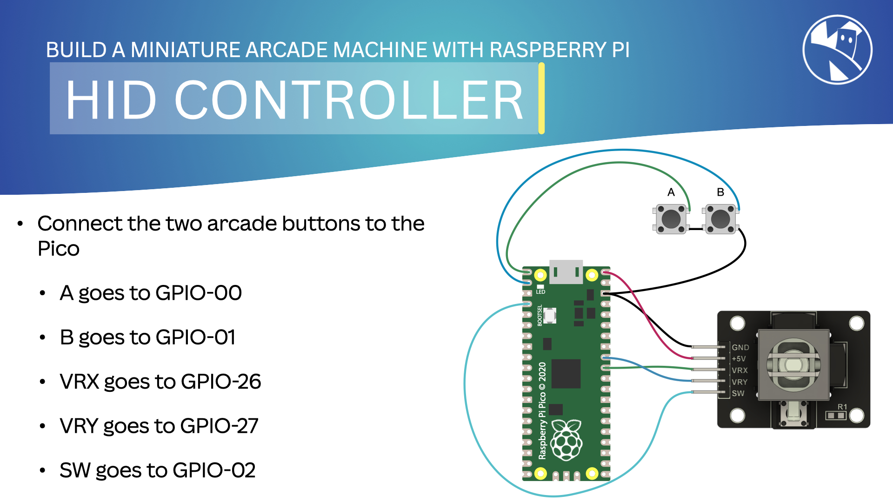

# CircuitPython Joystick controller for KevsArcade

This is a simple CircuitPython script that reads the analog joystick and buttons on a 2-axis arcade joystick and sends the data to a computer over USB. The computer can then use the data to control a game or other software.

The script is designed to work with the [KevsArcade](https://www.kevsrobots.co/kevsarcade) project.

## Hardware

The script is designed to work with the following hardware:

- KY-023 2 axis joystick module
- Raspberry Pi Pico
- 2x Arcade buttons (Pimoroni)

## Installation

1. Install CircuitPython on the Raspberry Pi Pico (Thonny can make this easy)
2. Copy the `code.py` file to the Pico - this will automatically run when the Pico is connected to a computer
3. Copy the `boot.py` file to the Pico - this will automatically run when the Pico is powered on and set it as a USB HID device
4. Copy the `hid_gamepad.py` file to the Pico - this is a library that allows the Pico to act as a USB HID device
5. Connect the joystick and buttons to the Pico as shown in the [`wiring.jpg`](wiring.jpg) file
6. Connect the Pico to the Raspberry Pi using a USB cable

---
